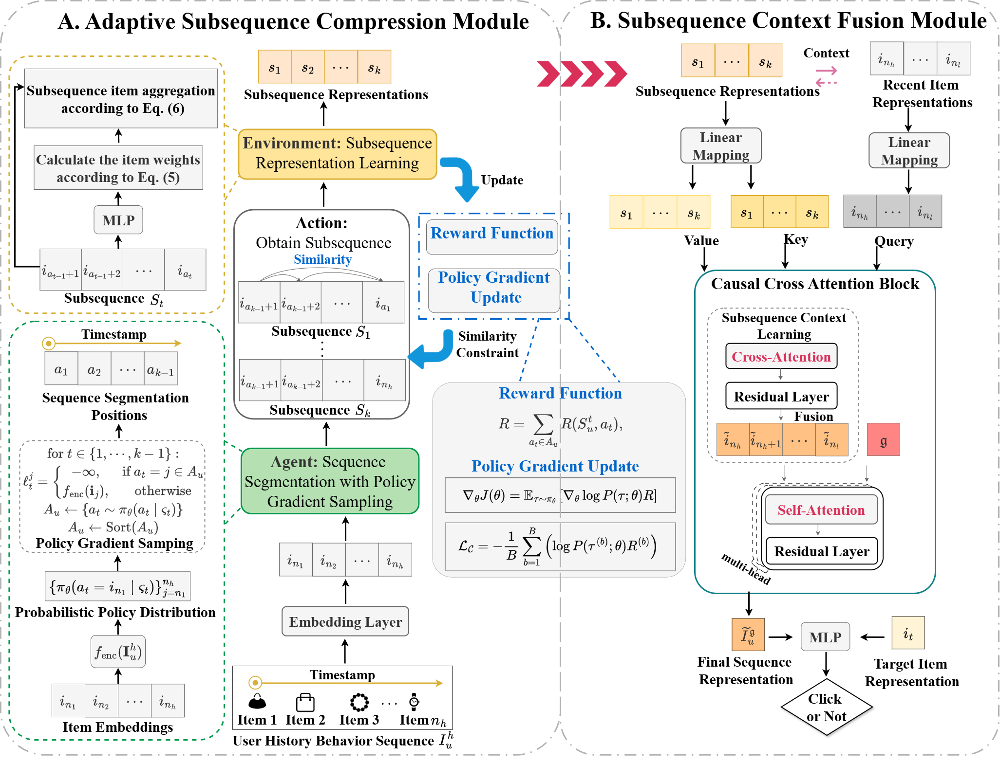

# Lifelong Sequential Recommendation with Adaptive Subsequence Compression and Contextual Fusion
## Abstract
> Lifelong sequential recommendation aims to model users’ long-term interests by leveraging their entire interaction history, but the high computational overhead caused by ultra-long sequences poses a core challenge. To address this, existing methods generally adopt the subsequence learning strategies to shorten the input sequence, which can be divided into two categories: (1) Sequence compression methods compress long sequences into multiple subsequence representations through strategies such as uniform segmentation and clustering; (2) Top-k retrieval methods filter the subsequence related to the target item from long sequences via target attention mechanisms or retrieval mechanisms and learn its representation. However, these two types of methods still face challenges in subsequence representation learning: (1) Sequence compression methods struggle to simultaneously balance the high similarity of items within subsequences and smooth temporal continuity (i.e., small temporal intervals between adjacent items), resulting in incorrect learning of subsequence representations; (2) Top-k retrieval methods lose a large amount of effective context information when the length of the retrieved subsequence is much smaller than the original sequence, resulting in incomplete sequence representations. To overcome these challenges, we propose a novel lifelong sequential recommendation method with adaptive subsequence compression and contextual fusion. Specifically, an adaptive subsequence compression module is first designed: it utilizes gradient policy sampling to achieve adaptive segmentation of subsequences, thereby retaining their temporal continuity, and introduces a reward function to enhance the similarity of items within subsequences. Second, a subsequence context fusion module is constructed: it leverages causal cross-attention to fuse recent interactions with their subsequence context and to capture correlations among recent items, thereby learning more complete and accurate sequence representations. We conduct extensive experiments on three public long-sequence recommendation datasets. Experimental results demonstrate that our proposed method consistently outperforms a variety of strong baselines in both predictive accuracy and computational efficiency.

<center>

</center>

## Dataset

| Dataset  | XLong   | Tmall    | KuaiRand-1K |
|----------|---------|---------|-------------|
| #User    | 49,692   | 6,982   | 516    |
| #Item    | 3,267,007   | 1,743,898  | 3,981,963     | 
| #AvgLen  | 1,000    | 1,278  | 18,742        | 

We conduct extensive experiments on three real-world and large-scale datasets ([XLong](https://tianchi.aliyun.com/dataset/22482), [Tmall](https://tianchi.aliyun.com/dataset/dataDetail?dataId=42), and [KuaiRand-1K](https://kuairand.com/)).

## Train
```bash
> python train.py --dataset_name $dataset_name$ --group_num $group_num$
```

## Test
```bash
> python test_valid.py
```


